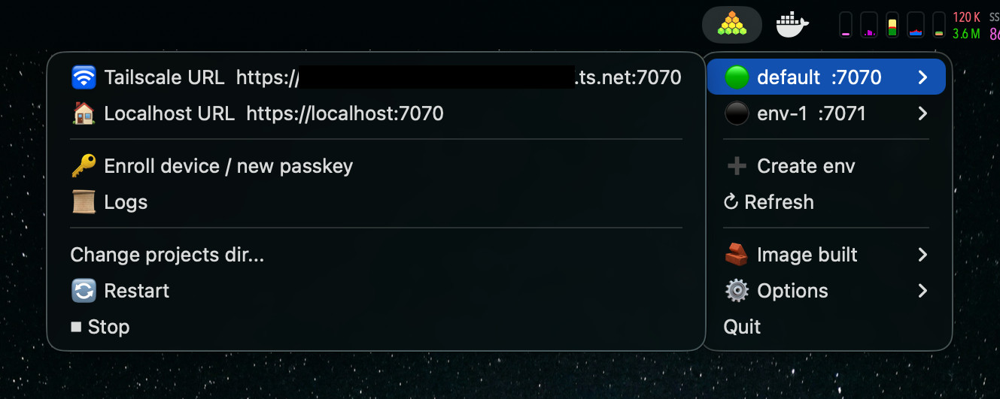

<p align="center">
  
</p>

# SwarmFleet

**Hot-reloaded Agentic UI Harness**

(README written entirely by a human) 

SwarmFleet is an AI agent harness inside a container that you can manipulate on-the-go thanks to hot-reloaded frontend and smart auto-restart of the backend and other components.

Kanban? Multi-agent orchestration? Team of cross-communicating agents? just start a new session and ask for it. SwarmFleet is the starting point for your wildest ideas.

**this is an alpha preview of the idea**  
it's far from production grade "ready".
the one thing i can say is that i personally use it all day everyday.

## How to use
requirements:
- Docker
- Python >= 3.9

```
git clone https://github.com/mrbar42/SwarmFleet.git
cd SwarmFleet
./swarmfleet.sh # launches the tray icon
```



You should see SwarmFleet tray icon, then:
- choose projects dir to be mounted into docker
- build the image (yes, yes, this will take a while... you can use `./build-docker.sh` for more visibility)
- tray icon > default env > start
- tray icon > default env > open URL
- configure a passkey
- configure a provider (codex, claude etc)
- start workin'
- use the "SwarmFleet Harness" project to modify the harness UI/server/anything

see [Advanced Usage](#advanced-usage) for additional info

## Main components
- container - a docker image with tools needed for dev env + headless chromium and service init scripts
- "manager" - a simple tray icon util
- harness
  - Web UI
  - server
  - custom MCP

## Notable features

- live harness
  - vite serves frontend
  - server watchdog that gracefully restarts
  - agent sessions are detached and uninterrupted by client/server restart
- agents wrapping
  - custom MCP server you can add commands to
  - sub agents
  - scheduled wake
  - prompt loop
- UI
  - multi project, multi session, multi providers (you can add more)
  - neat agentic UX, comparable to big labs desktop apps
  - files explorer
  - terminal
- mobile support
  - PWA
  - one responsive UI, mobile is fully capable
  - touch ready
- networking & security
  - passkey auth
  - https only using mkcert
  - never exposed openly to LAN
  - https tailscale access (auto detected)
- per project display service (runs dev server)
- telegram notifications

## How to update

```bash
git pull
./swarmfleet.sh # this will restart the manager
```

## Advanced Usage

Runtime state is stored under `~/.local/swarmfleet/` by default. Manager/global files live directly in that directory, and each environment keeps its own state under a stable directory such as `env-default/` or `env-2/`.

To run a separate state root manually:
```bash
SWARMFLEET_STATE_DIR=~/.local/swarmfleet2 SWARMFLEET_HOST_PORT=8070 ./run-docker-instance.sh
```

The source code mounted into the container always comes from the repository containing `run-docker-instance.sh`.

## Future outlook

SwarmFleet can evolve to become AI interface operating system with everything is fluid and changable on the spot, ever improving.
the missing piece is to compartmentalize the tools so it doesn't become a mega system that clutters the context of each agent.
we need to have a concept of "apps" or something like that that extends SwarmFleet while being activated on demand and hot-reloaded like the rest of the interface.
Once this extensibility concept is introduced it would be easier to add BIG features to SwarmFleet, like a video editor, designated workflow UI, game and so on.
would you rather the thing you're working on will be right there next to agent that does the work? all common AI apps work like this, but with SwarmFleet you can do it for EVERYTHING you can imagine.

## Honorable Mentions

- [CoderLuii/HolyClaude](https://github.com/CoderLuii/HolyClaude) - for inspiring the container
- [sugyan/claude-code-webui](https://github.com/sugyan/claude-code-webui) - for seeding the webui


---
[MIT License](./LICENSE)
